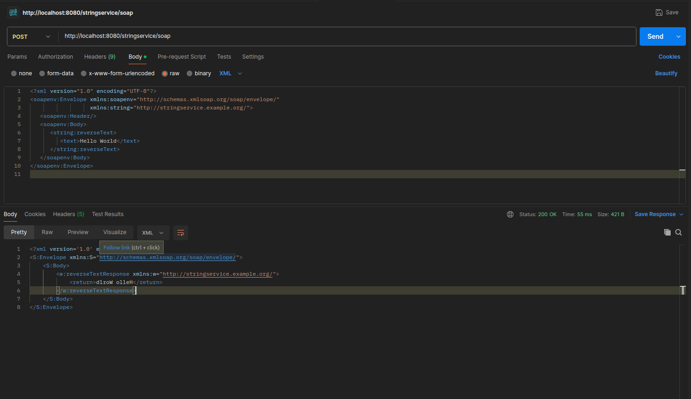

# Tutorial 1 

This is a simple SOAP application I created for the Tutorial 1 in Web Service technologoy course.

Registration No. 19APC4030 - S.S.Surendra

## StringManipulationService SOAP API

This repository contains a SOAP-based web service for string manipulation, including operations to reverse text and count characters. This guide provides instructions on how to test the service using **Postman**.

## Prerequisites
- **Postman** installed ([Download here](https://www.postman.com/)).
- The SOAP web service is running locally at `http://localhost:8080/stringservice/soap`.

## Testing with Postman

### 1. Open Postman
- Click **New** → **HTTP Request**.
- Set request type to **POST**.
- Set request URL to:
  ```
  http://localhost:8080/stringservice/soap
  ```

### 2. Set Headers
In the **Headers** tab, add:
```
Content-Type: text/xml
SOAPAction: ""
```

### 3. Send SOAP Requests

#### **Reverse Text Request**
```xml
<?xml version="1.0" encoding="UTF-8"?>
<soapenv:Envelope xmlns:soapenv="http://schemas.xmlsoap.org/soap/envelope/"
                  xmlns:string="http://stringservice.example.org/">
   <soapenv:Header/>
   <soapenv:Body>
      <string:reverseText>
         <text>Hello World</text>
      </string:reverseText>
   </soapenv:Body>
</soapenv:Envelope>
```
##### Expected Response:
```xml
<?xml version="1.0" encoding="UTF-8"?>
<soapenv:Envelope xmlns:soapenv="http://schemas.xmlsoap.org/soap/envelope/">
   <soapenv:Body>
      <reverseTextResponse xmlns="http://stringservice.example.org/">
         <return>dlroW olleH</return>
      </reverseTextResponse>
   </soapenv:Body>
</soapenv:Envelope>
```

#### **Count Characters Request**
```xml
<?xml version="1.0" encoding="UTF-8"?>
<soapenv:Envelope xmlns:soapenv="http://schemas.xmlsoap.org/soap/envelope/"
                  xmlns:string="http://stringservice.example.org/">
   <soapenv:Header/>
   <soapenv:Body>
      <string:countCharacters>
         <text>Hello</text>
      </string:countCharacters>
   </soapenv:Body>
</soapenv:Envelope>
```
##### Expected Response:
```xml
<?xml version="1.0" encoding="UTF-8"?>
<soapenv:Envelope xmlns:soapenv="http://schemas.xmlsoap.org/soap/envelope/">
   <soapenv:Body>
      <countCharactersResponse xmlns="http://stringservice.example.org/">
         <return>5</return>
      </countCharactersResponse>
   </soapenv:Body>
</soapenv:Envelope>
```

### 4. Send the Request
Click **Send**, and you should receive the expected response.

## Troubleshooting
- Ensure your SOAP service is running and accessible at `http://localhost:8080/stringservice/soap`.
- Check if Postman is configured correctly with **POST**, **headers**, and **raw XML body**.
- Verify that your SOAP XML is correctly formatted.

## Screen shots.




